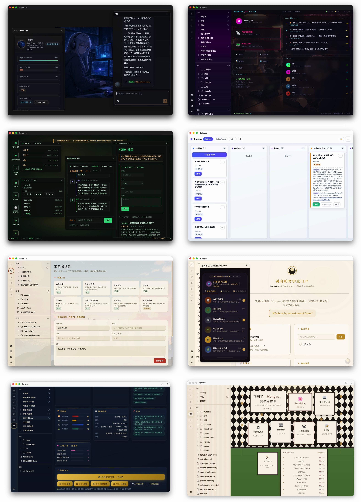

<div align="center">

# Spherse Extended

中文｜[EN](README.en.md)

**一个本地运行、开箱即用的个人 Agent 运行时。**

让多个拥有独立身份、权限、技能和自动化能力的 Agent，围绕同一个用户数据空间工作；再用 HTML 与 UI SDK，把 Agent 和数据组合成真正可交互的应用。

> 本仓库是 [mengrru/Spherse](https://github.com/mengrru/Spherse) 的功能拓展 fork：保留上游全部能力，叠加下文「功能拓展」的新特性。上游原始说明见 [README_origin.md](README_origin.md)。License 与上游一致（MIT）。

[](LICENSE)



</div>

## 功能拓展（本 fork 新增）

### 聊天

- **气泡右键**：复制选中文本，或以引用块插入输入框继续编辑发送。
- **会话内模型切换**：Composer 顶栏模型 pill，点击切换本会话持久模型；命令可带单次 override。
- **系统通知**：审批与 trigger 完成时推送。窗口失焦发 OS 通知，聚焦只走应用内 toast；最小化期间事件照常落盘，恢复不丢通知。
- **附件**：图片与文本类（txt/md/json）多附件发送，点击附件按钮选择文件。
- **编辑重发**：最后一个 user 消息可原地编辑后重新发送，编辑框自适应高度。
- **斜杠命令**：`/skill:` 调用 skill、`/command:` 调用项目级命令（支持 `$ARGUMENTS`/`$1..`/`@path` 展开），命令在左侧 Commands 面板管理。
- **召唤 Agent**：`>> <slug> <消息>` 把任务丢给另一个 Agent（fire-and-forget），当前会话留可跳转的召唤卡片。
- **桌宠模式**：浮窗收起为桌面小窗（形象圆 + 迷你输入框），会话右键「桌宠模式」进入，点击形象返回完整模式。
- **主题与滚动**：聊天主题按会话隔离、互不串色；历史滚动位置与贴底恢复。
- **HTML 嵌入实时聊天**：HTML 卡片里放一个聊天面板占位即可嵌入真聊天（流式/重试/审批可用），跟随 App 主题。

### 模型、语音与接入

- **Agent 默认模型**：每个 Agent 可单独选模型，不选跟随全局默认；会话内 pill 切换即持久到本会话。
- **TTS 朗读**：消息一键朗读，设置里可开自动朗读新回复（桌面端）。
- **自定义 Provider 请求头**：自建/网关 Provider 可配自定义 HTTP 请求头。
- **代理设置**：设置里配 HTTP 代理，模型请求走本地代理出站（桌面端）。

### 文件、标签与内容

- **文件左键单复用槽**：左键点文件复用当前内容标签（不再越点越多），中键/右键开新标签；聊天会话仍默认新标签。
- **标签管理**：标签右键关闭 / 关闭其他 / 关闭全部；左右分栏同时看两个文件。
- **Markdown**：大纲快速跳转、阅读态 checkbox 直接勾选落盘、编辑态搜索替换。
- **文件列表**：空白处右键、重命名、拖动移动、shift 多选批量删除。

## 内置 Skill

开箱即带 9 个 builtin skill（内存合并，随版本升级，不占项目磁盘）：

| Skill | 用途 |
| --- | --- |
| `spherse-guide` | 产品能力介绍与使用指引 |
| `spherse-write-html` | 写 HTML 前必读：数据读写与 App 能力调用约定 |
| `spherse-use-ui-sdk` | `window.spherse` SDK 调用参考 |
| `spherse-build-data-app` | 构建 HTML + Agent 共读写的数据型应用 |
| `spherse-embed-chat` | 在聊天 HtmlCard 里嵌入实时聊天面板 |
| `spherse-create-skill` | 自建 skill 的层级与格式规范 |
| `spherse-create-command` | 自建斜杠命令的文件格式与占位展开规则 |
| `spherse-create-ui-theme` | 项目级 UI 主题定制 |
| `spherse-create-agent-chat-theme` | Agent 聊天窗口主题定制 |

Skill 按 `Agent 私有 > .spherse/skills > .agents/skills > 内置` 合并，同名取最高优先级。源码在 `packages/presets/skills/`，自建 skill 放项目 `.spherse/skills/`（左侧 Skill 面板可视化管理）。

## 下载与安装

前往 [Releases](https://github.com/Thys1a/Spherse-extended/releases) 下载最新版本：

- **macOS**：下载对应架构的 `.dmg` 文件并拖入“应用程序”
- **Windows**：下载 `.exe` 安装包并运行

> [!NOTE]
> 当前 macOS 版本尚未使用 Apple Developer 证书签名。首次打开时如果出现“已损坏”或“无法验证开发者”提示，请在终端执行：
>
> ```bash
> xattr -cr /Applications/Spherse.app
> ```

安装后配置一个受支持的 LLM Provider API Key，即可创建项目和 Agent。

## 本地开发

环境要求：Node.js 22.19+。

```bash
git clone https://github.com/Thys1a/Spherse-extended.git
cd Spherse-extended
npm install
npm run dev
```

常用命令：

```bash
npm run build       # 构建所有 package
npm run verify      # lint、build、单元测试与 i18n 检查
npm run verify:e2e  # 完整检查 + Electron E2E
npm run dist        # 构建当前平台的安装包
```

项目采用 npm workspaces，主要由以下部分组成：

| Package | 职责 |
| --- | --- |
| `@spherse/core` | Agent、Session、Skill、Tool、Trigger 与本地数据运行时 |
| `@spherse/server` | Fastify HTTP/WebSocket API 与运行时契约 |
| `@spherse/app` | 桌面端与 Web 端共享的 React Renderer |
| `@spherse/desktop` | Electron 主进程、Preload、IPC 与桌面基础设施 |
| `@spherse/web` | 移动端 Web/PWA 宿主 |
| `@spherse/presets` | 内置模板、Skill 与示例内容 |
| `@spherse/i18n` | 国际化基础设施与翻译资源 |

详细架构与数据约定见 [`docs/official/`](docs/official/)，开发规范见 [`AGENTS.md`](AGENTS.md)。

## 技术栈

Electron · React · TypeScript · Fastify · pi-agent-core · pi-ai · MCP · SQLite · Zustand · Tailwind CSS

## License

[MIT](LICENSE)，上游项目见 [mengrru/Spherse](https://github.com/mengrru/Spherse)。
